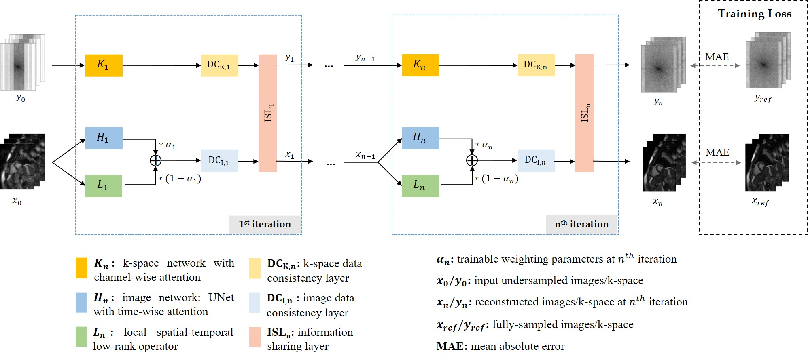

# A-LIKNet

**Attention incorporated network for sharing low-rank, image and k-space information during MR image reconstruction to achieve single breath-hold cardiac Cine imaging**

> Official Tensorflow implementation of our paper published in *Computerized Medical Imaging and Graphics (CMIG), Volume 120, March 2025*.

📄 **[Read the paper here](https://www.sciencedirect.com/science/article/pii/S0895611124001526)**  
✏️ **Authors**: Siying Xu, Kerstin Hammernik, Andreas Lingg, Jens Kübler, Patrick Krumm, Daniel Rueckert, Sergios Gatidis, Thomas Küstner

---

## 🔧 Overview

A-LIKNet is a novel deep learning framework for dynamic MR image reconstruction. It leverages **multi-domain attention mechanisms** to share features across **low-rank**, **image**, and **k-space** representations.

The core architecture includes:
- UNet with time-wise attention
- Local spatial-temporal low-rank modules
- K-space networks with coil-wise attention
- Iterative consistency and information sharing layers

<p align="center">
  
</p>

---

## 📁 Project Structure

```bash
A-LIKNet/
├── data_pipeline/        # Data preprocessing and loading
├── model/                # Network architecture and training logic
├── pictures/             # Visualizations (network diagrams etc.)
├── utils/                # Utility functions (metrics, visualization)
└── README.md             # Project description and usage
